# Secure CRM Platform — Master Architecture and Design

## Document Control
- Version: 1.0.0
- Date: 2025-11-17
- Owners: Architecture Team
- Status: Draft
- Scope: Secure CRM application spanning React frontend, FastAPI backend, and PostgreSQL database

## 1. System Overview
The Secure CRM application is a multi-container platform providing omni-channel customer service, ticketing, and analytics for BFSI-grade operations. It includes Customer 360, service request and complaint management, workflow automation, BOT/CTI/social integrations, dashboards, reporting, strong security controls, audit, and compliance alignment. The current codebase includes:
- Frontend: React (SPA), basic scaffold with theme toggle
- Backend: FastAPI, CORS enabled, health endpoint and OpenAPI export tooling
- Database: PostgreSQL setup scripts, backup/restore scripts, and a general-purpose DB visualizer

This document consolidates the RFP functional and non-functional requirements with the present repository state to define a complete, actionable architecture and module-level design baseline.

## 2. Container Architecture
The solution is composed of three containers: frontend, backend, and database. The backend is the central orchestrator integrating external channels and internal systems, while the frontend provides UX for agents and supervisors. The database persists customer, case, workflow, and audit data.

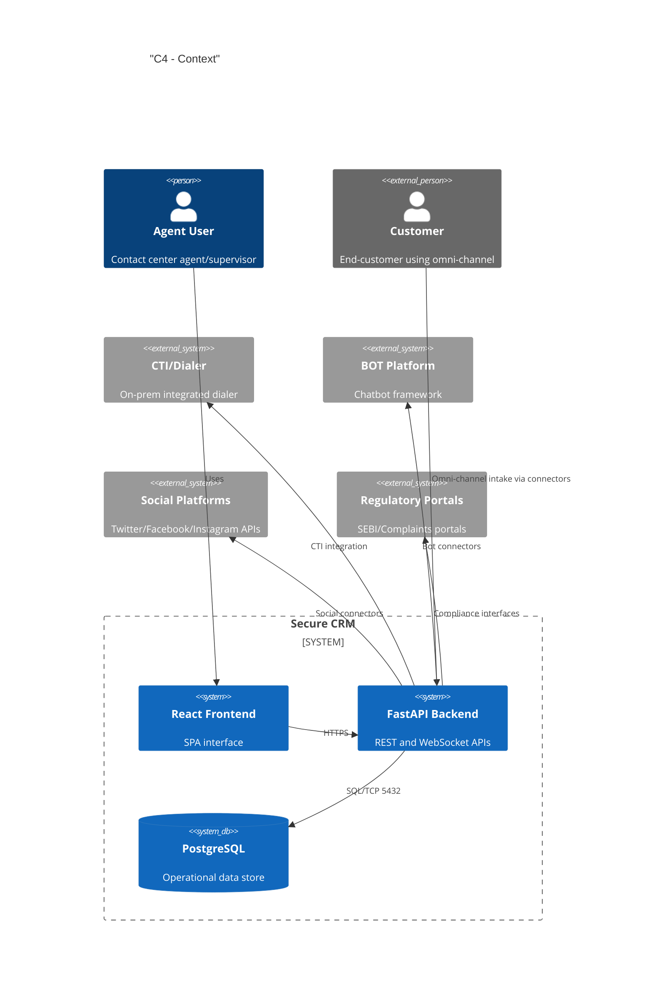

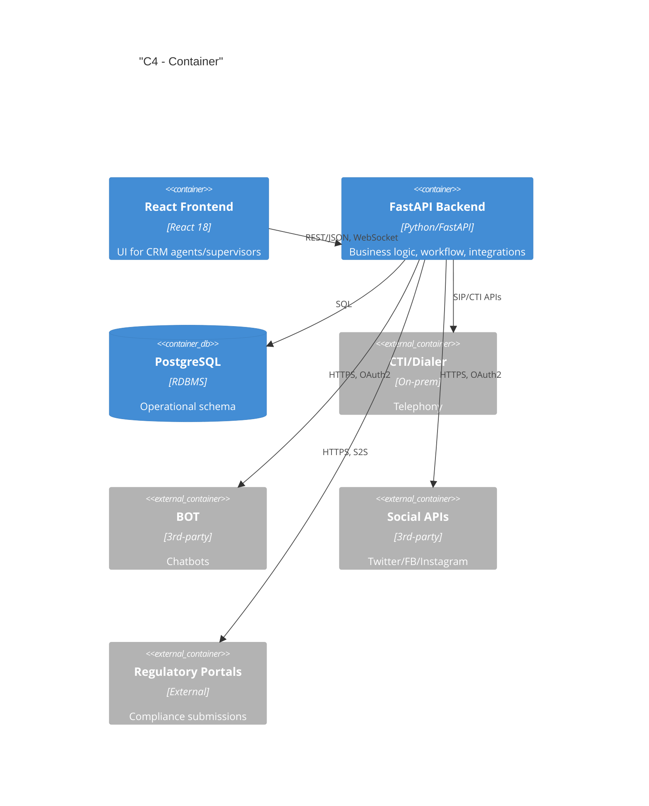

## 3. Module-by-Module Design
Each module includes purpose, scope, responsibilities, inputs/outputs, data models, APIs, workflows, error handling, security and compliance, and non-functional requirements.

### 3.1 Authentication & Authorization
- Purpose: Provide secure access (RBAC), session management, and token handling
- Scope: Login, MFA (optional), refresh, role-policy mapping (agent, supervisor, auditor, admin)
- Responsibilities: Identity verification, access token issuance, policy enforcement
- Inputs: Credentials/identity assertions; Outputs: JWT/OAuth2 tokens; Audit logs for access
- Data Models:
  - users(id, username, email, phone, status, mfa_enabled, created_at)
  - roles(id, name, description)
  - user_roles(user_id, role_id)
  - permissions(id, resource, action)
  - role_permissions(role_id, permission_id)
- APIs (planned; FastAPI):
  - POST /auth/login
  - POST /auth/refresh
  - POST /auth/logout
  - GET /auth/me
- Workflows:
  - Sequence: User submits credentials → Backend validates → Token issued → RBAC on each request
- Error handling: Standardized error payloads, 401/403, lockout and backoff for brute force
- Security & compliance: OWASP ASVS, password hashing (Argon2/BCrypt), rate limiting, audit
- NFRs: 99.5% auth service uptime; <300ms p95 token issuance

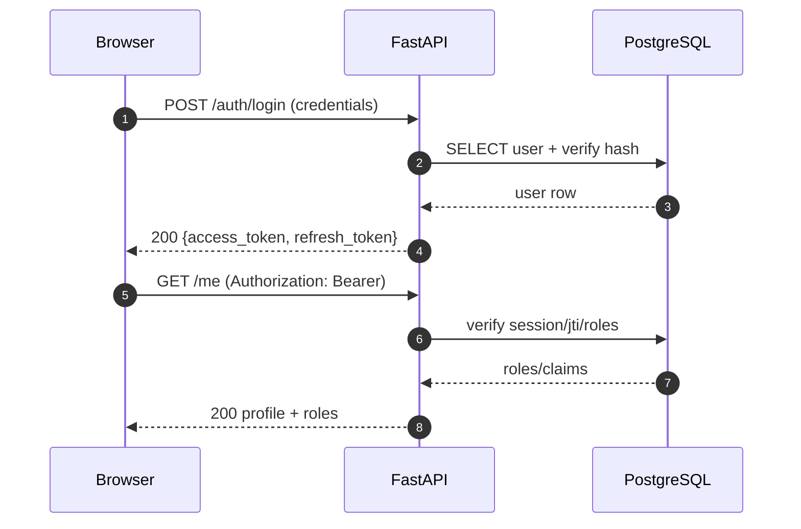

### 3.2 Customer 360
- Purpose: Unified view of customer profiles, accounts, interactions, tickets, and context
- Scope: Profile lookup, related accounts/policies, interaction history, open SRs/complaints
- Responsibilities: Aggregate from CRM DB and external systems (EDW, policy systems as future)
- Inputs: customer_id, phone, email; Outputs: 360 DTO aggregating entities and KPIs
- Data Models:
  - customers(id, master_customer_no, name, dob, kyc_status, risk_rating, pii_encrypted, ...)
  - contact_points(id, customer_id, type, value, verified_at)
  - interactions(id, customer_id, channel, subject, summary, occurred_at, source_ref)
  - relationships(customer_id, related_customer_id, relation_type)
- APIs:
  - GET /customers/{id}/360
  - GET /customers: search by phone/email/name
- Workflows: Resolve identity → gather entities → compute derived signals (e.g., churn risk)
- Error handling: 404 not found, partial data with warnings if upstream systems degraded
- Security: Field-level masking, PII encryption at rest, least-privilege views
- NFRs: p95 < 600ms for 360 load with caching

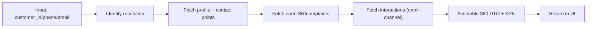

### 3.3 Service Request (SR) Lifecycle
- Purpose: Capture, triage, fulfill, and close service requests with SLA
- Data Models:
  - service_requests(id, customer_id, type, priority, status, sla_due_at, assigned_to, created_at, updated_at)
  - sr_activities(id, sr_id, action, actor_id, notes, created_at)
  - sr_sla_log(sr_id, breached, breach_at, reason)
- APIs:
  - POST /service-requests
  - GET /service-requests/{id}
  - PATCH /service-requests/{id} (status transitions)
- Workflow:
  - Intake → classify → assign (skill/rules) → work → resolve → CSAT
- Error handling: Validation errors, illegal state transitions (409)
- Security: RBAC (agents vs supervisors), audit on all state changes
- NFRs: SLA adherence tracking; bulk upload supported later per RFP

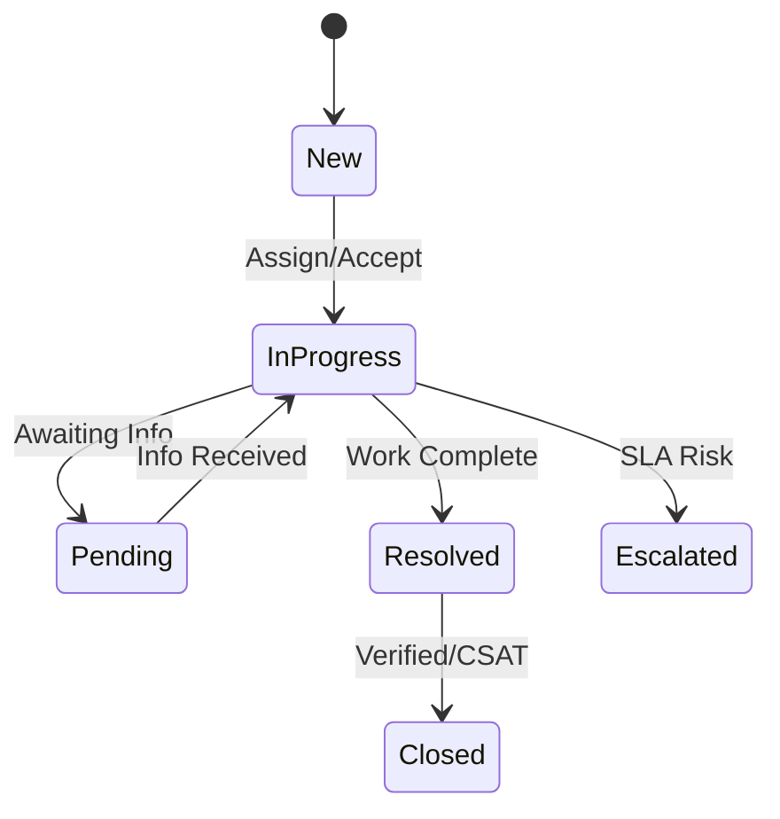

### 3.4 Complaint Management and Escalation
- Purpose: Register complaints, manage escalations by SLA tiers, regulatory alignment
- Data Models:
  - complaints(id, customer_id, category, severity, status, regulator_flag, created_at)
  - complaint_escalations(id, complaint_id, level, escalated_at, to_team, reason)
- APIs:
  - POST /complaints
  - PATCH /complaints/{id}/escalate
- Workflow: Register → Assess → Assign → Resolve → Escalate based on SLA/timebox
- Security: Full audit trail linked to user and timestamp

### 3.5 Omni-channel Intake
- Purpose: Intake and normalize interactions from phone (CTI), email, chat, web, social
- Data Models:
  - channels(id, name, type)
  - channel_events(id, channel_id, external_id, payload, normalized, created_at)
- APIs: Webhook endpoints for email/chat/social; CTI callbacks
- Workflows: Event received → validation → normalization → route to SR/complaint or interaction

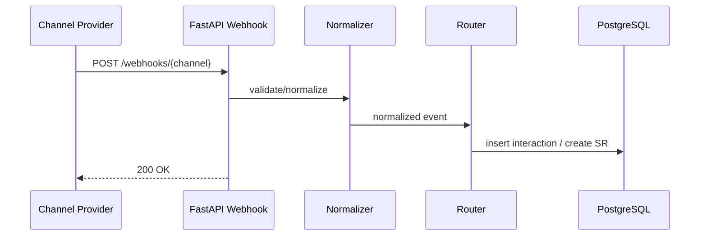

### 3.6 BOT/CTI/Social Connectors
- Purpose: Integrate third-party providers
- Connector abstraction:
  - table connectors(id, type, name, config_ref, enabled)
  - connector_runs(id, connector_id, status, started_at, completed_at, error)
- Protocols: HTTPS REST with OAuth2 for BOT/social; CTI via provider-specific SDKs/APIs; retries and backoff
- Error handling: Circuit-breakers, retry with exponential backoff; DLQ (dead-letter table) for failed events

### 3.7 Knowledge Management
- Purpose: Agent scripts, FAQs, canned responses, approvals for publishing
- Data Models:
  - knowledge_articles(id, title, body_md, status, owner_id, approved_by, version)
  - canned_responses(id, key, template, locale)
- APIs: CRUD with workflow; search endpoints

### 3.8 Workflow Automation
- Purpose: No/low-code rules for routing and escalations
- Data Models:
  - workflows(id, name, definition_json, version, active)
  - workflow_runs(id, workflow_id, entity_ref, status, started_at, ended_at)
- Execution: Stateless engine per event; versioned definitions

### 3.9 Reporting & Analytics
- Purpose: Dashboards, SLA metrics, NPS/CSAT, agent productivity
- Data: Precomputed aggregates; potential materialized views; export endpoints (CSV/Excel)

### 3.10 Audit Logging
- Purpose: Immutable audit of sensitive operations
- Data Models:
  - audit_logs(id, actor_id, action, entity_type, entity_id, diff_json, ip, user_agent, created_at)
- Controls: Tamper-evident hashing chain (optional); retention per compliance policy

## 4. Architecture Diagrams (Component Views)
Below are component-level views for critical modules.

## 5. Key User Journeys (Flows)
### 5.1 Customer 360
See Module 3.2 flowchart.

### 5.2 Service Request Lifecycle
See state diagram in 3.3.

### 5.3 Complaint Escalation
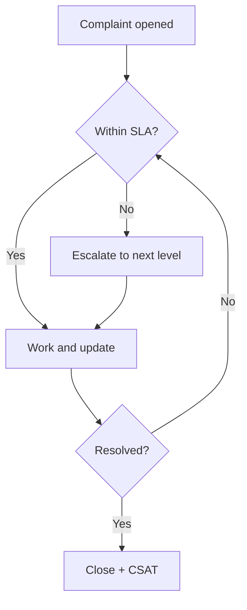

### 5.4 Omni-channel Intake
See 3.5 sequence.

### 5.5 BOT/CTI/Social Connectors
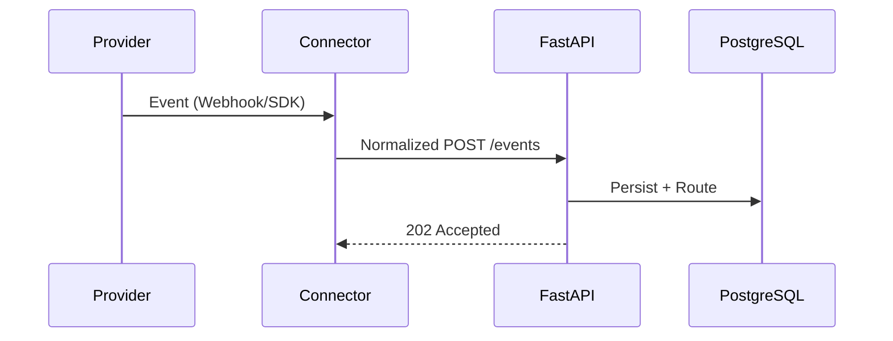

### 5.6 Authentication & Authorization
See 3.1 sequence.

### 5.7 Audit Logging
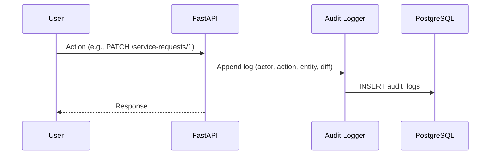

### 5.8 Reporting & Analytics
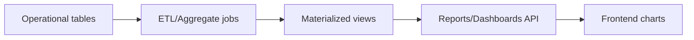

## 6. Data Architecture
### 6.1 ERD (High-Level)
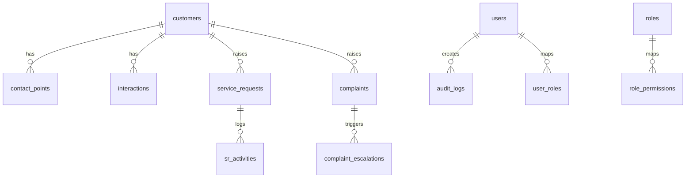

### 6.2 Schema Outline (initial)
- customers(id PK, master_customer_no, name, pii_encrypted JSONB, created_at)
- contact_points(id PK, customer_id FK, type, value_enc, verified_at)
- interactions(id PK, customer_id FK, channel, subject, summary, occurred_at)
- service_requests(id PK, customer_id FK, type, priority, status, sla_due_at, assigned_to FK users.id)
- sr_activities(id PK, sr_id FK, action, actor_id FK users.id, notes, created_at)
- complaints(id PK, customer_id FK, category, severity, status, regulator_flag)
- complaint_escalations(id PK, complaint_id FK, level, escalated_at, to_team, reason)
- users, roles, user_roles, permissions, role_permissions
- audit_logs(id PK, actor_id FK users.id, action, entity_type, entity_id, diff_json, ip, user_agent, created_at)

### 6.3 Data Retention & PII Handling
- PII encryption at rest using pgcrypto or application-layer encryption
- Field-level masking policies by role
- Data retention policies per regulator; configurable per table/domain
- Right-to-erasure workflows where legally applicable, with audit evidence

## 7. Integration Architecture
- Connectors: Abstraction layer per provider with retry/backoff
- Protocols: HTTPS REST with OAuth2; CTI via on-prem SDK/API; Webhooks for inbound
- Rate limits: Centralized limiter per connector; 429 handling with jittered exponential backoff
- Dead-letter queue: Persist failed payloads with reason and replay tools
- Idempotency: Idempotency keys for webhook POSTs

## 8. Security Architecture
- RBAC: Role to permission mapping enforced middleware-side
- Input validation: Pydantic schemas, strict typing; reject unknown fields
- Encryption:
  - In-transit: TLS 1.2+ for all HTTP
  - At rest: Disk encryption and field-level PII encryption
- Secrets management: Environment variables sourced from a secrets vault (planned)
- Audit & monitoring: All admin-sensitive CRUD audited with immutable logs
- Compliance: Align with SEBI guidance, internal/external audits, VAPT readiness
- Offline data security: If offline/PWA supported, local encrypted storage and remote wipe

## 9. Deployment Architecture and Environments
- Envs: dev, test, staging, prod; isolated DBs and credentials
- Network: Backend connects to DB over restricted network; frontend served via CDN/edge (future)
- Availability: Target 99.5% uptime; no single point of failure, DR aligned
- Containerization: Each service packaged and orchestrated (future; currently local scripts)

## 10. Observability
- Logs: Structured JSON logging with correlation IDs; no sensitive data in logs
- Metrics: Request latency, error rates, SLA breaches, connector health
- Traces: Distributed tracing (OpenTelemetry) planned
- SLOs: API p95 < 300ms auth, < 600ms 360; 99.5% availability

## 11. Migration/DR/BCP
- Migration: Data migration with validation and reconciliation reports
- DR: RPO ≤ 15 minutes, RTO ≤ 2 hours; periodic drills
- Backups: Daily full, hourly WAL/incremental; restore runbooks (backup_db.sh, restore_db.sh present)

## 12. Open Questions & Assumptions
- Assumptions:
  - CTI provider exposes API compatible with integration patterns noted
  - Social/BOT platforms allow necessary scopes
  - Regulatory portal integration specs available
- Open Questions:
  - Finalize identity provider and MFA method
  - Define exact data retention durations per entity
  - Confirm on-prem vs cloud deployment targets and KMS selection

## 13. Traceability
- RFP functional requirements mapped to modules 3.1–3.10
- SEBI/compliance requirements addressed in sections 8, 11

## 14. References
- FastAPI backend health and OpenAPI generator in codebase
- PostgreSQL startup/backup/restore scripts
- React frontend scaffold with theme toggle

