# Secure CRM Platform — Master Architecture and Design

## Document Control
- Version: 1.1.0
- Date: 2025-11-17
- Owners: Architecture Team
- Status: Draft
- Scope: Secure CRM application spanning React frontend, FastAPI backend, and PostgreSQL database
- Sources: RFP_CRM_Omnichannel_Ticketing_system_1.pdf; current repository code across frontend/backend/database

## 1. System Overview
The Secure CRM application is a multi-container platform providing omni-channel customer service, ticketing, and analytics for BFSI-grade operations. It includes Customer 360, service request and complaint management, workflow automation, BOT/CTI/social integrations, dashboards, reporting, strong security controls, audit, and compliance alignment. The current codebase includes:
- Frontend: React (SPA), minimal scaffold with theme toggle
- Backend: FastAPI, CORS enabled, health endpoint and OpenAPI export tooling
- Database: PostgreSQL setup/startup scripts, backup/restore scripts, and an optional DB visualizer

This document consolidates the RFP functional and non-functional requirements with the present repository state to define a complete, actionable architecture and module-level design baseline. Where features are future work, the document provides design placeholders aligned with the RFP.

## 2. Container Architecture
The solution is composed of three containers: frontend, backend, and database. The backend is the central orchestrator integrating external channels and internal systems, while the frontend provides UX for agents and supervisors. The database persists customer, case, workflow, and audit data.

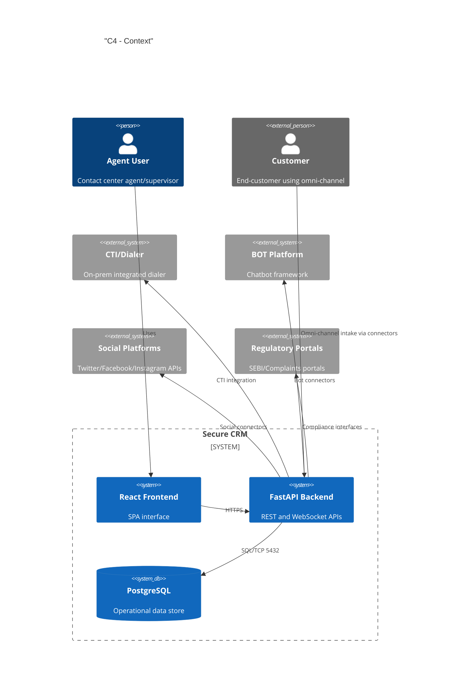

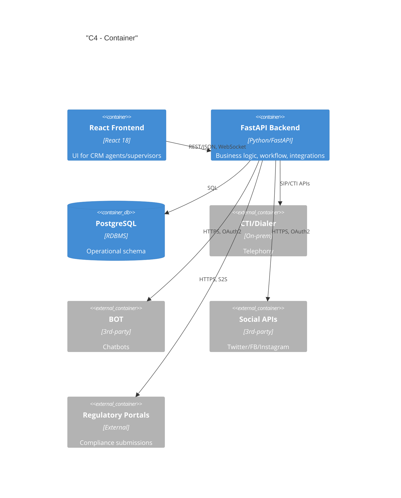

## 3. Module-by-Module Design
Each module includes purpose, scope, responsibilities, inputs/outputs, data models, APIs, workflows, error handling, security and compliance, and non-functional requirements. Refer to module specs in kavia-docs/modules for detailed drill-downs.

### 3.1 Authentication & Authorization
- Purpose: Provide secure access (RBAC), session management, and token handling
- Scope: Login, refresh, logout, MFA (per RFP mobility and offline security), role-policy mapping (agent, supervisor, auditor, admin)
- Responsibilities: Identity verification, token issuance/rotation, policy enforcement
- Inputs: Credentials/identity assertions; Outputs: JWT/OAuth2 tokens; Audit logs for access
- Data Models:
  - users(id, username, email, phone, status, mfa_enabled, created_at)
  - roles(id, name, description)
  - user_roles(user_id, role_id)
  - permissions(id, resource, action)
  - role_permissions(role_id, permission_id)
  - sessions(id, user_id, jti, issued_at, expires_at, revoked)
- APIs (planned; FastAPI):
  - POST /auth/login, POST /auth/refresh, POST /auth/logout, GET /auth/me
- Workflows:
  - User submits credentials → Backend validates → Token issued → RBAC on each request → Audit
- Error handling: Standardized error payloads, 401/403, lockout and backoff for brute force
- Security & compliance: OWASP ASVS, password hashing (Argon2/BCrypt), rate limiting, audit
- NFRs: 99.5% auth service uptime; <300ms p95 token issuance

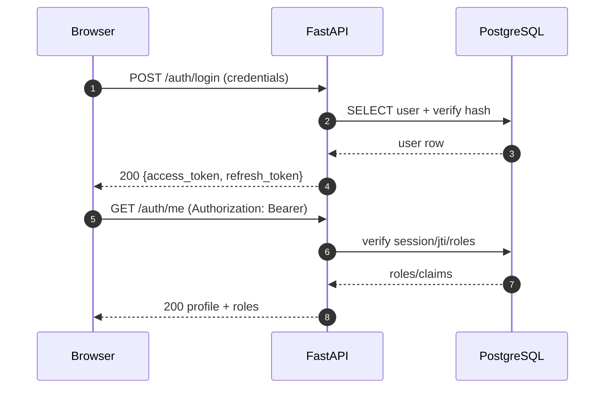

### 3.2 Customer 360
- Purpose: Unified view of customer profiles, accounts, interactions, tickets, and context
- Scope: Profile lookup, related accounts/policies, interaction history, open SRs/complaints
- Responsibilities: Aggregate from CRM DB and external systems (EDW, policy systems future)
- Inputs: customer_id, phone, email; Outputs: 360 DTO aggregating entities and KPIs
- Data Models:
  - customers(id, master_customer_no, name, dob, kyc_status, risk_rating, pii_encrypted, ...)
  - contact_points(id, customer_id, type, value_enc, verified_at)
  - interactions(id, customer_id, channel, subject, summary, occurred_at, source_ref)
  - relationships(customer_id, related_customer_id, relation_type)
- APIs:
  - GET /customers/{id}/360
  - GET /customers?query=
- Error handling: 404 not found, partial data with warnings if upstream systems degraded
- Security: Field-level masking, PII encryption at rest, least-privilege views
- NFRs: p95 < 600ms with caching

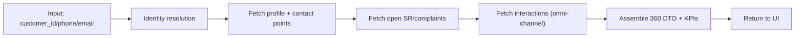

### 3.3 Service Request (SR) Lifecycle
- Purpose: Capture, triage, fulfill, and close service requests with SLA
- Data Models:
  - service_requests(id, customer_id, type, priority, status, sla_due_at, assigned_to, created_at, updated_at)
  - sr_activities(id, sr_id, action, actor_id, notes, created_at)
  - sr_sla_log(sr_id, breached, breach_at, reason)
- APIs:
  - POST /service-requests
  - GET /service-requests/{id}
  - PATCH /service-requests/{id} (status transitions)
- Error handling: Validation errors, illegal state transitions (409)
- Security: RBAC (agents vs supervisors), audit on all state changes
- NFRs: SLA adherence tracking; bulk upload per RFP roadmap

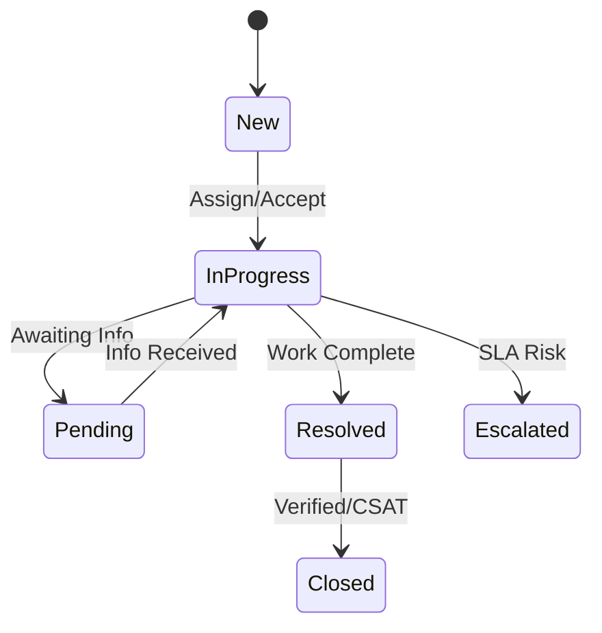

### 3.4 Complaint Management and Escalation
- Purpose: Register complaints, manage escalations by SLA tiers, regulatory alignment (SEBI/IGMS)
- Data Models:
  - complaints(id, customer_id, category, severity, status, regulator_flag, created_at)
  - complaint_escalations(id, complaint_id, level, escalated_at, to_team, reason)
- APIs: POST /complaints, GET /complaints/{id}, PATCH /complaints/{id}, POST /complaints/{id}/escalate
- Workflow: Register → Assess → Assign → Resolve → Escalate based on SLA/timebox
- Security: Full audit trail linked to user and timestamp; regulator_flag handling

### 3.5 Omni-channel Intake
- Purpose: Intake and normalize interactions from phone (CTI), email, chat, web, social
- Data Models: channels, channel_events
- APIs: POST /webhooks/{channel}, GET /channels, GET /channels/{id}/events
- Workflows: Event received → validation → normalization → route to SR/complaint or interaction
- Idempotency and signature verification as per provider

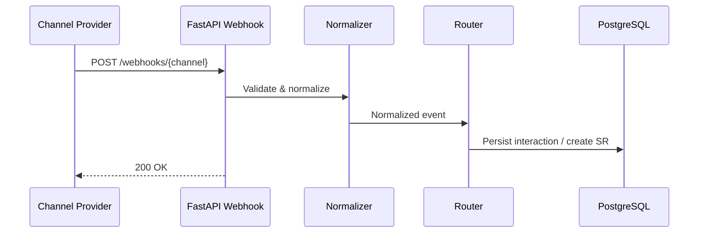

### 3.6 BOT/CTI/Social Connectors
- Purpose: Integrate third-party providers (Knowlarity/Aspect/TeleSoft; social; chatbot)
- Data Models: connectors, connector_runs, dead_letters
- Protocols: HTTPS REST with OAuth2; CTI via SDKs/APIs; retries and backoff; quality sampling support
- Security: Vaulted secrets, scoped tokens, PII redaction in logs

### 3.7 Knowledge Management
- Purpose: Agent scripts, FAQs, canned responses, approvals for publishing
- Data Models: knowledge_articles, canned_responses
- APIs: CRUD + workflow; search endpoints

### 3.8 Workflow Automation
- Purpose: Rules-based routing, escalations, reminders (drag-and-drop intent per RFP)
- Data Models: workflows, workflow_runs
- APIs: Workflow CRUD; triggers

### 3.9 Reporting & Analytics
- Purpose: Dashboards, SLA metrics, NPS/CSAT, agent productivity; exports
- Data: Precomputed aggregates/materialized views; ad-hoc queries; CSV/Excel

### 3.10 Audit Logging
- Purpose: Immutable audit of sensitive operations
- Data Models: audit_logs (and optional audit_hash_chain)
- APIs: GET /audit?filters (restricted), admin exports
- Compliance: Retention and auditability per RFP info security specs

## 4. Architecture Diagrams (Component Views)
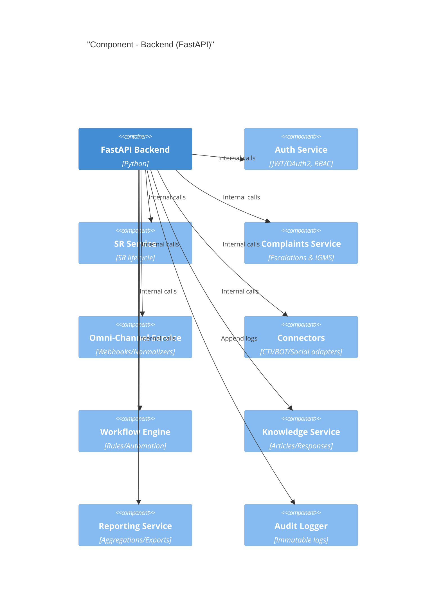

## 5. Key User Journeys (Flows)
### 5.1 Customer 360
See Module 3.2 flowchart.

### 5.2 Service Request Lifecycle
See state diagram in 3.3.

### 5.3 Complaint Escalation
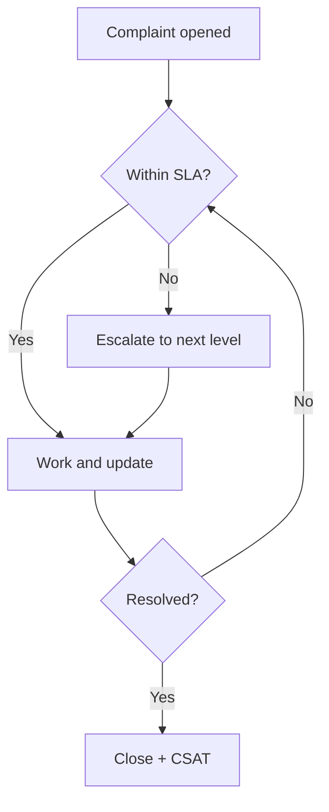

### 5.4 Omni-channel Intake
See 3.5 sequence.

### 5.5 BOT/CTI/Social Connectors
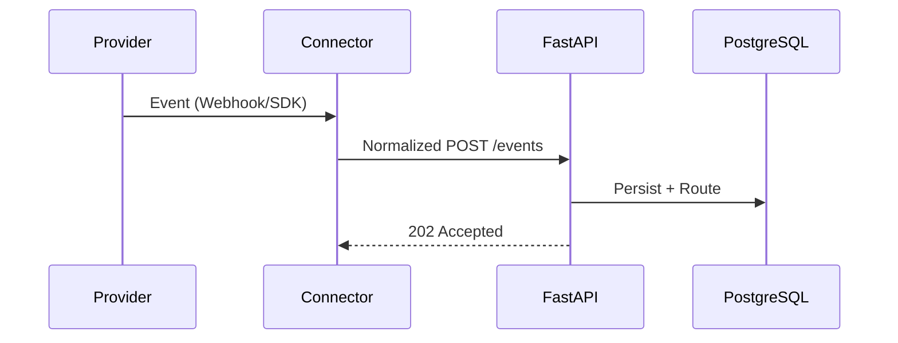

### 5.6 Authentication & Authorization
See 3.1 sequence.

### 5.7 Audit Logging
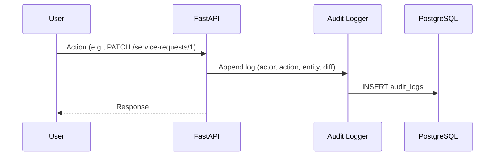

### 5.8 Reporting & Analytics
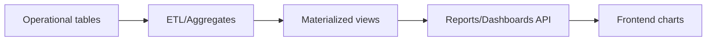

## 6. Data Architecture
### 6.1 Detailed References
- Data Architecture: kavia-docs/modules/11-Data_Architecture.md
- Data Lifecycle and Retention: kavia-docs/modules/11.1-Data_Lifecycle_and_Retention.md
- Indexing and Performance: kavia-docs/modules/11.2-Indexing_and_Performance.md
- Partitioning and Sharding: kavia-docs/modules/11.3-Partitioning_and_Sharding.md
- Backup, Restore, and DR: kavia-docs/modules/11.4-Backup_Restore_and_DR.md
- Data Security and Privacy: kavia-docs/modules/11.5-Data_Security_and_Privacy.md

### 6.2 ERD (High-Level)
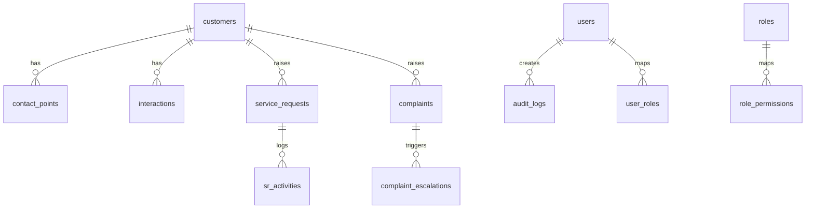

### 6.3 Schema Outline (initial)
- customers(id PK, master_customer_no, name, pii_encrypted JSONB, created_at)
- contact_points(id PK, customer_id FK, type, value_enc, verified_at)
- interactions(id PK, customer_id FK, channel, subject, summary, occurred_at, source_ref)
- service_requests(id PK, customer_id FK, type, priority, status, sla_due_at, assigned_to FK users.id)
- sr_activities(id PK, sr_id FK, action, actor_id FK users.id, notes, created_at)
- complaints(id PK, customer_id FK, category, severity, status, regulator_flag)
- complaint_escalations(id PK, complaint_id FK, level, escalated_at, to_team, reason)
- users, roles, user_roles, permissions, role_permissions
- audit_logs(id PK, actor_id FK users.id, action, entity_type, entity_id, diff_json, ip, user_agent, created_at)

### 6.4 Data Retention & PII Handling
- Encryption at rest (e.g., pgcrypto) and application-level for high-risk fields
- Field-level masking policies by role and context (support auditors’ SoD)
- Retention policies per regulator; legal hold handling; immutable audit
- Right-to-erasure workflows where applicable and audit evidence trails

### 6.5 Operational Scripts and Traceability
- RFP: Data security, audit, retention and DR in Information security specifications (Annexure sections in the attached RFP).
- Database scripts:
  - secure-crm-platform-40906-40916/crm_database/startup.sh
  - secure-crm-platform-40906-40916/crm_database/backup_db.sh
  - secure-crm-platform-40906-40916/crm_database/restore_db.sh

## 7. Integration Architecture
- Connectors: Abstraction layer per provider with retry/backoff and circuit breaking
- Protocols: HTTPS REST with OAuth2; CTI via on-prem SDK/API; Webhooks for inbound
- Rate limits: Central limiter per connector; 429/backoff with jitter
- Dead-letter queue: Persist failed payloads with reason and replay tools
- Idempotency: Idempotency keys for webhook POSTs
- Regulatory: IGMS/SEBI portal integration interfaces and SLAs

## 8. Security Architecture
- RBAC & SoD: Role to permission mapping; maker-checker where applicable
- Input validation: Pydantic schemas; reject unknown fields; strict types
- Encryption:
  - In-transit: TLS 1.2+; HSTS; modern ciphers
  - At rest: Disk + field-level encryption for PII
- Secrets management: Environment variables backed by vault/KMS (planned)
- Audit & monitoring: Immutable audit logs; SIEM integration (RFP: logging/alerts)
- Compliance: SEBI guidelines; VAPT; internal/external audits; mobile/offline encryption
- Session management: Short-lived tokens; revoke/blacklist; concurrent session controls
- DLP considerations: Avoid sensitive data in logs and exports; masking by default

## 9. Deployment Architecture and Environments
- Environments: dev, test, staging, prod with isolated DBs and credentials
- Network: Backend→DB over restricted network; frontend served statically via CDN/edge (future)
- Availability: Target 99.5% uptime; no single point of failure; HA posture and DR readiness
- Containerization: Each service packaged; orchestration roadmap (k8s) for HA & scaling
- Backups: backup_db.sh, restore_db.sh operationalized; WAL archiving for RPO targets

## 10. Observability
- Logs: Structured JSON with correlation IDs; scrub PII
- Metrics: Request latency, error rates, SLA breaches, queue depths, connector health
- Traces: OpenTelemetry instrumentation roadmap
- SLOs: API p95 < 300ms auth, < 600ms 360; 99.5% availability; connector availability > 99%

## 11. Migration/DR/BCP
- Migration: Data migration phases; validation and reconciliation; cutover plan
- DR: RPO ≤ 15 min, RTO ≤ 2 hours; periodic drills; passive site readiness
- BCP: Offline capabilities for mobile/agents with encrypted local cache; sync conflict policies

## 12. Open Questions & Assumptions
- Assumptions:
  - CTI provider exposes API compatible with integration patterns noted
  - Social/BOT platforms allow necessary scopes and webhooks
  - Regulatory portal integration specs available for IGMS
- Open Questions:
  - Finalize identity provider and MFA method and device policies
  - Define exact data retention durations per entity (per SEBI/audit)
  - Confirm on-prem vs cloud target and KMS selection; jurisdictional constraints

## 13. Traceability
- RFP functional requirements: Customer 360, SR/Complaints, Omni-channel, BOT/CTI, Workflow, Reporting (Sections: Annexure I/II)
- Information Security specifications: Reflected in Sections 8, 10, 11
- Architecture constraints and SLAs: Section 3, 7, 9, 10 align with RFP Architecture/SLAs

## 14. References
- Backend: FastAPI health and OpenAPI generator (src/api/main.py, src/api/generate_openapi.py)
- Database: PostgreSQL startup/backup/restore scripts (startup.sh, backup_db.sh, restore_db.sh)
- Frontend: React scaffold (theme toggle) as baseline for UI

