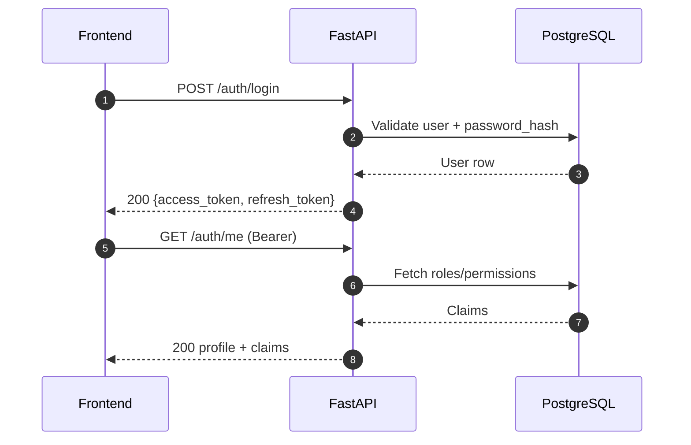

# Module Design — Authentication and RBAC

## Purpose
Provide secure authentication, authorization, and role-based access controls for all CRM services and UIs.

## Scope
- User login, token issuance and refresh
- Role and permission mapping
- Session management and introspection
- MFA (optional extension)

## Responsibilities
- Verify identity and issue tokens
- Enforce authorization checks on every protected endpoint
- Maintain audit logs for login/logout and sensitive privilege changes

## Inputs and Outputs
- Inputs: Credentials, MFA assertions, refresh tokens
- Outputs: Access/refresh tokens, user profile/claims, error responses

## Data Models
- users(id, username, email, phone, password_hash, status, mfa_enabled, created_at, updated_at)
- roles(id, name, description)
- permissions(id, resource, action)
- user_roles(user_id, role_id)
- role_permissions(role_id, permission_id)
- sessions(id, user_id, jti, issued_at, expires_at, revoked)

## APIs (FastAPI planned)
- POST /auth/login
- POST /auth/refresh
- POST /auth/logout
- GET /auth/me
- Admin: CRUD for roles/permissions and assignments (protected)

## Workflows

## Error Handling
- 400 for malformed payloads
- 401 for invalid credentials or expired token
- 403 for insufficient permissions
- Token blacklist on logout/revocation

## Security & Compliance
- Password hashing (Argon2 or BCrypt)
- JWT with short-lived access tokens and rotating refresh tokens
- Rate limiting login attempts; IP/device fingerprint optional
- Full audit of auth events; no PII in logs
- Aligns with SEBI and internal infosec directives

## Non-Functional Requirements
- p95 < 300ms for login and /me
- 99.5% availability
- Horizontal scalability; stateless token verification

## Traceability
- RFP: Information security, audit/compliance, role-based data access

## Repository References
- Backend scaffolding and OpenAPI generation: crm_backend/src/api/main.py, crm_backend/src/api/generate_openapi.py
- Database setup and policies: crm_database/startup.sh, backup_db.sh, restore_db.sh
