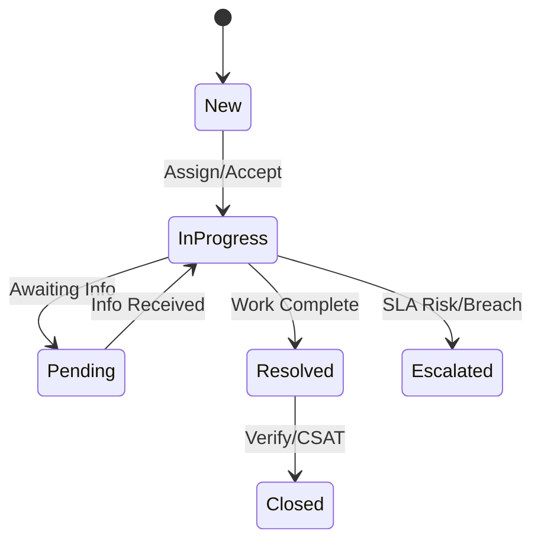

# Module Design — Service Request Lifecycle

## Purpose
Manage end-to-end lifecycle of service requests with SLA compliance and auditability.

## Scope
- Intake, classification, assignment, progress, resolution, and closure
- CSAT capture and reporting

## Responsibilities
- Enforce state machine transitions and SLAs
- Integrate with workflow automation and connectors

## Inputs and Outputs
- Inputs: SR payloads, updates, attachments metadata
- Outputs: SR records, activities, SLA status

## Data Models
- service_requests(id, customer_id, type, priority, status, sla_due_at, assigned_to, created_at, updated_at)
- sr_activities(id, sr_id, action, actor_id, notes, created_at)
- sr_sla_log(sr_id, breached, breach_at, reason)

## APIs
- POST /service-requests
- GET /service-requests/{id}
- PATCH /service-requests/{id}
- GET /service-requests?filters

## Workflow

## Error Handling
- Validation errors 400
- Illegal transitions 409
- SLA breach alerts and escalations

## Security & Compliance
- RBAC on actions and views
- Audit all state changes and assignments

## Non-Functional Requirements
- SLA computation efficiency
- Bulk operations for campaigns (as per RFP roadmap)

## Traceability
- RFP: Auto-flow, queueing, reminders, skill-based assignment

## Repository References
- Backend baseline: crm_backend/src/api/main.py
- Data model extensions to be added per Data Architecture module
