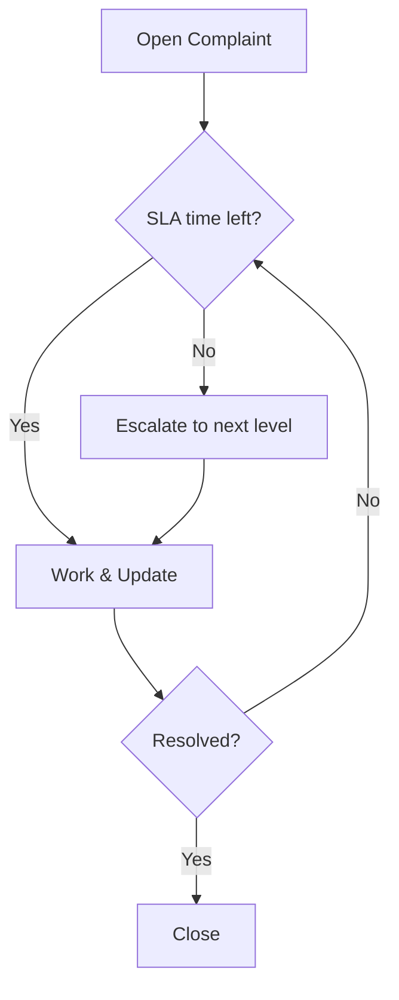

# Module Design — Complaint Management and Escalation

## Purpose
Log, track, resolve, and escalate customer complaints with regulatory alignment.

## Scope
- Complaint registration, categorization, SLA, escalations, regulatory flags
- Linking to service requests and historical context

## Responsibilities
- Ensure escalations per policy levels and timelines
- Provide reporting for regulatory compliance

## Inputs and Outputs
- Inputs: Complaint details, attachments metadata
- Outputs: Complaint records, escalation events, statuses

## Data Models
- complaints(id, customer_id, category, severity, status, regulator_flag, created_at, updated_at)
- complaint_escalations(id, complaint_id, level, escalated_at, to_team, reason)

## APIs
- POST /complaints
- GET /complaints/{id}
- PATCH /complaints/{id}
- POST /complaints/{id}/escalate

## Workflow

## Error Handling
- Invalid categories or unknown customer → 400
- Escalation conflicts → 409 with resolution suggestions

## Security & Compliance
- PII protection; regulator_flag controls reporting
- Full audit for all changes

## Non-Functional Requirements
- p95 < 500ms read, < 700ms write typical
- High reliability for escalations

## Traceability
- RFP: Complaint tracking, auto escalations, regulatory portal integration
