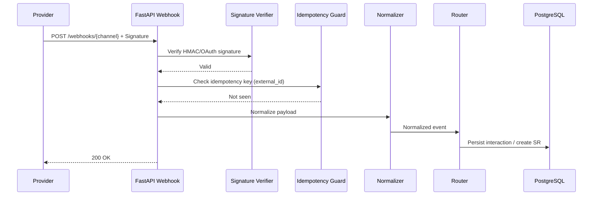

# Module Design — Omni-channel Intake

## Purpose
Ingest and normalize customer interactions across phone, email, chat, web, and social channels.

## Scope
- Webhook endpoints, validation, normalization, routing to SR/complaints/interactions
- Duplicate detection, idempotency

## Responsibilities
- Channel-specific payload handling
- Durable persistence and retry/backoff for failures

## Inputs and Outputs
- Inputs: Provider webhook payloads or SDK events
- Outputs: Channel events, interactions, SRs/complaints as applicable

## Data Models
- channels(id, name, type)
- channel_events(id, channel_id, external_id, payload_json, normalized, created_at)

## APIs
- POST /webhooks/{channel}
- GET /channels
- GET /channels/{id}/events

## Workflow

## Error Handling
- 400 for invalid signatures/payloads
- Idempotency key handling returns 200 on duplicate
- Circuit breaker on provider failures

## Security & Compliance
- HMAC signatures per provider
- Rate limiting per source
- Audit of intake and routing decisions

## Non-Functional Requirements
- High-throughput ingest with queueing (future)
- Backpressure control and DLQ tables

## Traceability
- RFP: Omni-channel logging/track through multiple channels

## Repository References
- Webhook services will be implemented in FastAPI (crm_backend/src/api/)
- Persistence in PostgreSQL per Data Architecture; backup/restore via provided scripts
