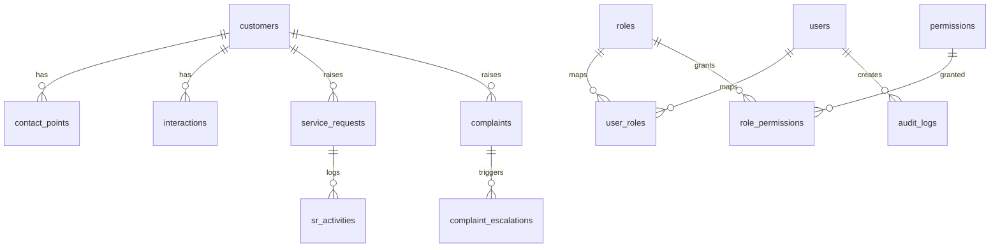

# Module Design — Data Architecture

## Purpose
Define a coherent, secure, and compliant data model for CRM operations including customers, interactions, service requests, complaints, workflows, knowledge content, and audits.

## Scope
- Logical and physical schema, keys and relationships
- PII encryption and masking
- Retention and archival policies
- Data quality, idempotency, and lineage

## Responsibilities
- Maintain normalized schemas for core entities
- Provide views and materialized views for reporting and dashboards
- Enforce constraints and reference integrity

## Inputs and Outputs
- Inputs: API payloads, connector events, user actions
- Outputs: Normalized tables, aggregates, and views for analytics

## ERD (Detailed)


## Entity Definitions

### customers
- Columns: id(uuid PK), tenant_id(uuid FK tenants.id, optional), master_customer_no(text unique), name(text), dob(date nullable), kyc_status(text), risk_rating(text), pii_encrypted(jsonb), last_interaction_at(timestamptz), created_at(timestamptz default now()), updated_at(timestamptz)
- Constraints: unique(master_customer_no); CHECK on kyc_status, risk_rating enumerations; NOT NULL on name minimality per policy
- FKs: tenant_id -> tenants.id (if multi-tenant)
- Notes: PII stored in pii_encrypted (enveloped); soft delete via deleted_at; RLS enabled

### contact_points
- Columns: id(uuid PK), customer_id(uuid FK customers.id), type(text enum: phone,email,address), value_enc(bytea), value_norm(text nullable), verified_at(timestamptz)
- Constraints: unique(type, value_norm) when value_norm present; NOT NULL(customer_id, type)
- Notes: value_enc encrypted; value_norm is normalized for uniqueness and searching with masking at presentation

### interactions
- Columns: id(uuid PK), customer_id(uuid FK customers.id), channel(text), subject(text), summary(text), occurred_at(timestamptz), source_ref(text), attachments(jsonb)
- Constraints: NOT NULL(customer_id, channel, occurred_at)
- Indexes: (customer_id, occurred_at desc), (channel, occurred_at desc)
- Notes: Partition by month on occurred_at for scale

### service_requests
- Columns: id(uuid PK), customer_id(uuid FK), type(text), priority(text), status(text), sla_due_at(timestamptz), assigned_to(uuid FK users.id), created_at(timestamptz default now()), updated_at(timestamptz)
- Constraints: CHECK on enumerations; NOT NULL(customer_id, type, status, priority)
- Indexes: (assigned_to, status), (sla_due_at) WHERE active statuses
- Notes: Consider tenant_id if multi-tenant; temporal updates tracked in sr_activities

### sr_activities
- Columns: id(uuid PK), sr_id(uuid FK service_requests.id), action(text), actor_id(uuid FK users.id), notes(text), created_at(timestamptz default now())
- Constraints: NOT NULL(sr_id, action, actor_id)

### complaints
- Columns: id(uuid PK), customer_id(uuid FK customers.id), category(text), severity(text), status(text), regulator_flag(boolean), created_at(timestamptz default now()), updated_at(timestamptz)
- Indexes: (customer_id), (status, created_at desc), (regulator_flag) WHERE regulator_flag = true

### complaint_escalations
- Columns: id(uuid PK), complaint_id(uuid FK complaints.id), level(int), escalated_at(timestamptz), to_team(text), reason(text)
- Constraints: NOT NULL(complaint_id, level, escalated_at)

### knowledge_articles
- Columns: id(uuid PK), title(text), body_md(text), status(text), owner_id(uuid FK users.id), approved_by(uuid FK users.id), version(int), locale(text), created_at(timestamptz default now())
- Constraints: status enum; version increment policy

### canned_responses
- Columns: id(uuid PK), key(text unique), template(text), locale(text)

### workflows
- Columns: id(uuid PK), name(text), definition_json(jsonb), version(int), active(boolean), created_at(timestamptz default now())
- Constraints: unique(name, version)

### workflow_runs
- Columns: id(uuid PK), workflow_id(uuid FK workflows.id), entity_type(text), entity_id(uuid), status(text), started_at(timestamptz), ended_at(timestamptz)

### audit_logs
- Columns: id(uuid PK), actor_id(uuid FK users.id), action(text), entity_type(text), entity_id(uuid), diff_json(jsonb), ip(inet), user_agent(text), created_at(timestamptz default now())
- Constraints: No PII in diff_json; CHECKs for size limits; index on (created_at desc) and (entity_type, entity_id)

### RBAC tables
- users(id uuid PK, username text unique, email text, phone text, status text, mfa_enabled boolean, created_at timestamptz)
- roles(id uuid PK, name text unique, description text)
- permissions(id uuid PK, resource text, action text)
- user_roles(user_id uuid FK users.id, role_id uuid FK roles.id, PRIMARY KEY (user_id, role_id))
- role_permissions(role_id uuid FK roles.id, permission_id uuid FK permissions.id, PRIMARY KEY (role_id, permission_id))

## Normalization Decisions
- 3NF for core entities to avoid anomalies:
  - contact_points separated from customers to handle multiple contacts and verification metadata.
  - sr_activities separated to model many events per service_request.
  - complaint_escalations separated to capture multilevel escalation timeline.
- Denormalization only in read models (materialized views) for dashboards and reports.
- Enumerations implemented via CHECK constraints or small lookup tables when change frequency is low; use text + CHECK for agility early on.

## Keys and Identity
- Surrogate Keys: UUID v4 (gen_random_uuid()) for primary keys across all major tables to avoid hot spots and support distributed systems.
- Natural Keys: master_customer_no retained with unique constraint for interoperability; not used as PK to avoid external coupling.
- Foreign Keys: Enforced for referential integrity with ON DELETE restrictions; use CASCADE only where data lifecycle clearly matches (e.g., sr_activities on SR hard delete during purge).

## UUID and Sequences
```sql
CREATE EXTENSION IF NOT EXISTS pgcrypto;
-- Or use pguuid-ossp if preferred: CREATE EXTENSION IF NOT EXISTS "uuid-ossp";
```
- Prefer pgcrypto gen_random_uuid() for performance and simplicity.

## Temporal and Audit Patterns
- Row Timestamps: created_at, updated_at on mutable entities; updated via triggers or application logic.
- Temporal History (optional): Use history tables for critical entities with INSERT-only strategy to capture previous states (e.g., service_requests_history).
- Audit: audit_logs for append-only action logging with strict size limits and no PII.

## Constraints and Checks
- CHECK on status/priority/category to valid sets.
- NOT NULL for mandatory references.
- Unique constraints for natural keys (master_customer_no, canned_responses.key).
- Exclusion of soft-deleted conflicts via partial unique indexes if needed.

## Views and Materialized Views
- Provide read-optimized views for Customer 360 and SLA dashboards.
- Materialize heavy aggregations; refresh concurrently off-peak.

## Partitioning Guidance
- interactions and audit_logs partitioned by time; see Partitioning_and_Sharding module (11.3) for DDL and routing.

## Indexing Overview
- See Indexing_and_Performance module (11.2) for detailed index definitions and maintenance guidance.

## Security, RLS, and Encryption
- Field-level encryption for sensitive attributes; see Data_Security_and_Privacy (11.5).
- RLS enabled for tenant and soft-delete filtering; views for masking.

## Example DDL Snippets
```sql
CREATE TABLE IF NOT EXISTS customers (
  id uuid PRIMARY KEY DEFAULT gen_random_uuid(),
  master_customer_no text UNIQUE,
  name text NOT NULL,
  pii_encrypted jsonb,
  last_interaction_at timestamptz,
  created_at timestamptz NOT NULL DEFAULT now(),
  updated_at timestamptz,
  deleted_at timestamptz
);

CREATE TABLE IF NOT EXISTS contact_points (
  id uuid PRIMARY KEY DEFAULT gen_random_uuid(),
  customer_id uuid NOT NULL REFERENCES customers(id),
  type text NOT NULL,
  value_enc bytea NOT NULL,
  value_norm text,
  verified_at timestamptz
);
```

## Traceability
- RFP Annexure I/II alignments: information security, retention, audit trail, scalability.
- Repository references: secure-crm-platform-40906-40916/crm_database/startup.sh, backup_db.sh, restore_db.sh for operational alignment.

