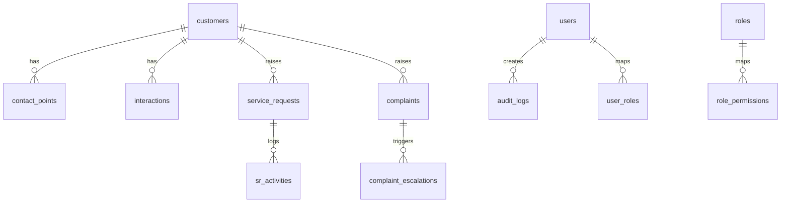

# Module Design — Data Architecture

## Purpose
Define a coherent, secure, and compliant data model for CRM operations including customers, interactions, service requests, complaints, workflows, knowledge content, and audits.

## Scope
- Logical and physical schema, keys and relationships
- PII encryption and masking
- Retention and archival policies
- Data quality, idempotency, and lineage

## Responsibilities
- Maintain normalized schemas for core entities
- Provide views and materialized views for reporting and dashboards
- Enforce constraints and reference integrity

## Inputs and Outputs
- Inputs: API payloads, connector events, user actions
- Outputs: Normalized tables, aggregates, and views for analytics

## ERD (High-Level)

## Schema Outline (initial)
- customers(id PK, master_customer_no, name, pii_encrypted JSONB, created_at)
- contact_points(id PK, customer_id FK, type, value_enc, verified_at)
- interactions(id PK, customer_id FK, channel, subject, summary, occurred_at, source_ref)
- service_requests(id PK, customer_id FK, type, priority, status, sla_due_at, assigned_to FK users.id)
- sr_activities(id PK, sr_id FK, action, actor_id FK users.id, notes, created_at)
- complaints(id PK, customer_id FK, category, severity, status, regulator_flag)
- complaint_escalations(id PK, complaint_id FK, level, escalated_at, to_team, reason)
- knowledge_articles(id PK, title, body_md, status, owner_id, approved_by, version, locale)
- canned_responses(id PK, key, template, locale)
- workflows(id PK, name, definition_json, version, active, created_at)
- workflow_runs(id PK, workflow_id FK, entity_type, entity_id, status, started_at, ended_at)
- audit_logs(id PK, actor_id FK users.id, action, entity_type, entity_id, diff_json, ip, user_agent, created_at)
- users, roles, permissions, user_roles, role_permissions

## PII Handling and Encryption
- Encrypt sensitive fields at rest using pgcrypto (or application-layer envelope encryption)
- Store minimal PII; prefer tokenization for external references
- Masking policy by role and purpose (auditor vs agent vs admin)

## Retention and Archival
- Define per-entity retention (e.g., interactions 24 months, audit 7 years, subject to SEBI/internal policy)
- Archival to cold storage with index metadata to enable discovery under legal hold
- Support right-to-erasure workflows where applicable with auditable tombstones

## Data Quality and Idempotency
- Idempotency keys on webhook events (channel_events.external_id + channel_id unique)
- Constraints and check conditions on enumerations and statuses
- Periodic integrity checks and reconciliation jobs

## Security & Compliance
- Principle of least privilege with DB roles and schemas
- Separate read-only reporting role
- No PII in logs or materialized views unless explicitly masked

## Non-Functional Requirements
- Maintain p95 < 50ms for common reads on indexed fields
- Support batch loads for bulk ticket operations with staging tables

## Traceability
- RFP Annexure I/II data security, retention, offline encryption requirements; Information Security specifications

