# Secure CRM Frontend — UI/UX Master Specification

## Document Control
- Version: 1.0.0
- Date: 2025-11-17
- Owners: UX Design Team
- Status: Draft
- Scope: React SPA CRM frontend
- Theme: Heritage Brown (Classic)
- Sources: Architecture_Master.md, modules 01–14, RFP (selected chunks), frontend scaffold (React)

## 1. Information Architecture and Navigation Map
The CRM frontend follows a Classic, enterprise layout: a persistent left Sidebar for global navigation, a TopBar for contextual actions and global utilities, and a main content area with tabs and panels. The IA emphasizes operational workflows for agents and supervisors, exposing modules that map directly to core CRM capabilities.

Primary navigation (Sidebar):
- Dashboard
- Customer 360
- Service Requests
  - All Requests
  - My Queue
  - SLA At Risk
- Complaints
  - Intake
  - Escalations
- Omni-channel Inbox
  - Voice/CTI
  - Email
  - Chat
  - Social
- Knowledge
- Reporting & Analytics
- Settings
  - Users & Roles
  - Connectors
  - Preferences
- Help & Support

Global utilities (TopBar):
- Universal Search (customers, SR, complaints)
- Notifications (toasts, alerts)
- Quick Create (SR, Complaint, Note)
- User Menu (Profile, Settings, Logout)

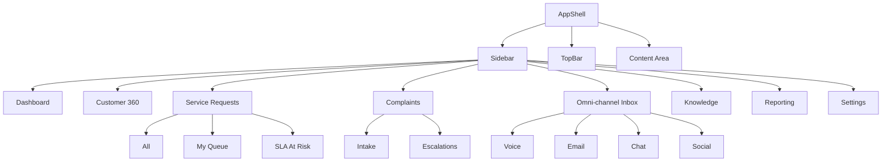

## 2. Screen Inventory and Taxonomy
- Overview screens: Dashboard, Reporting & Analytics
- Entity views: Customer360, ServiceRequest_Detail, Complaint_Detail
- Forms & creation: ServiceRequest_Form, Complaint_Form
- Operational queues: OmniChannel_Inbox (voice/email/chat/social), Service Requests queues
- System/auth: Auth_Login, Settings
- Supportive: Knowledge, Search results, Modals

Screen taxonomy:
- List + Filters (DataTable heavy)
- Detail + Related tabs (cards, timelines)
- Wizard/Stepper (multi-step forms)
- Inbox (multi-column triage with preview)
- Auth (single-column centered)

## 3. User Personas and Key Journeys
Personas:
- Agent: Resolves SRs/complaints; triages inbox; uses Customer 360; creates SRs.
- Supervisor: Monitors SLA, handles escalations; configures queues; views reports.
- Auditor/Compliance: Reviews audit trails and regulatory flags; read-only scoped.
- Admin: Manages users, roles, connectors, global settings.

Key journeys:
- Agent: Identify customer → Open Customer 360 → Create SR → Work the SR → Resolve → Close with CSAT.
- Supervisor: Review SLA at risk → Reassign/Escalate → Monitor resolution → Approve closure.
- Intake: Handle inbound email/chat/social → Normalize → Create/Link SR/Complaint → Route to queue.

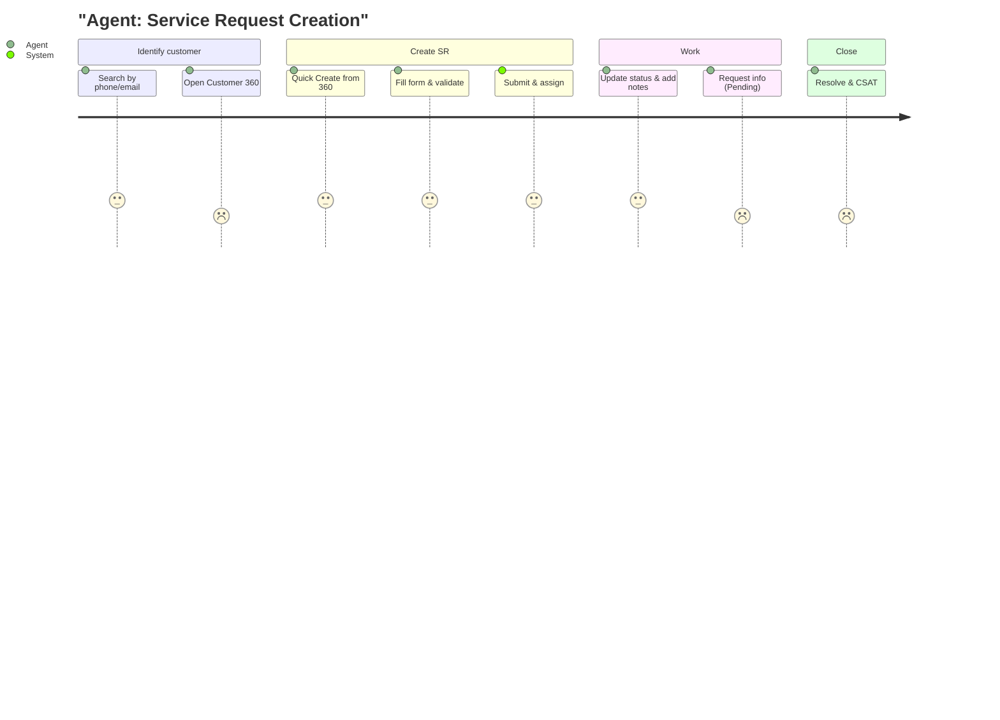

## 4. Detailed Screen Layouts (Annotated Wireframes)
Note: Wireframes are conceptual; implement with DataTable, Cards, Tabs, Forms, and Modals as documented.

### 4.1 Dashboard
- Top KPIs: Open SRs, SLA at Risk, Open Complaints, Today’s Inbox
- Charts: SR by Status, Complaints by Severity, Channel Mix
- Tables: My Queue, Recent Interactions

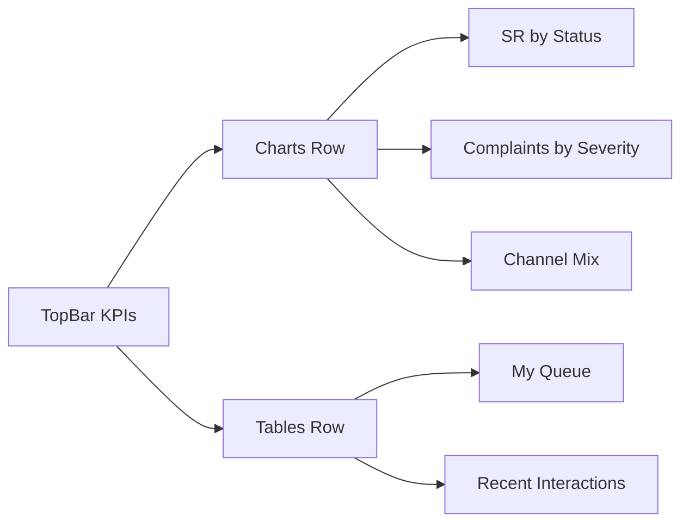

### 4.2 Customer 360
- Header with identity, risk, KYC, status pills
- Tabs: Profile, Accounts/Policies, Interactions timeline, Open Items (SR/Complaints), Notes
- Right panel: Quick actions (Create SR/Complaint), contact points

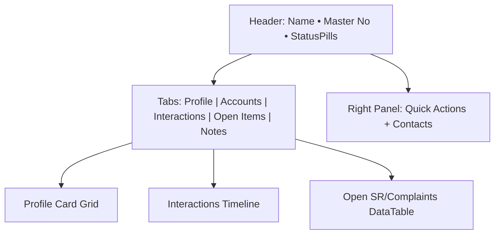

### 4.3 Service Request — Form (Wizard)
- Steps: Customer → Details → Attachments → Review → Submit
- Validation and conditional fields based on type/priority

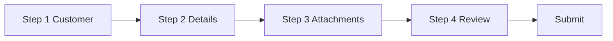

### 4.4 Service Request — Detail
- Header: SR id, priority, status pill, SLA due
- Tabs: Overview, Activity (timeline), Attachments, Related
- Side panel: Assignee, watchers, actions (Transition buttons)

### 4.5 Complaints
- List with filters (severity, regulator_flag)
- Detail mirrors SR with escalation panel

### 4.6 Omni-channel Inbox
- Left: Folders/Channels
- Center: Thread list
- Right: Preview panel with actions (Reply, Create SR/Link)

## 5. Component Library (Properties, States, Variants, A11y)
- AppShell: props {sidebarCollapsed, user, onToggleSidebar}
- Sidebar: props {items, activeKey}; keyboard focusable, roving tabindex
- TopBar: props {onSearch, onQuickCreate, notifications}
- DataTable: props {columns, data, sort, pagination, selection, density}; states: loading/empty/error
- Filters: props {fields, values, onApply, onReset}; chips display
- Form controls: Input, Select, DatePicker, TextArea, RichTextEditor; validation + aria-invalid
- Modals/Dialogs: props {title, open, onClose, footer}; trap focus; Esc to close
- Tabs: props {items, activeKey}; aria-controls/tabpanel semantics
- Cards: props {title, actions, elevation}; subtle shadows
- Stepper: props {steps, active, onNext, onBack}
- Toasts: props {message, tone, autoDismiss}; roles: status/alert
- Pagination: props {page, pageSize, total, onChange}
- Search: props {placeholder, onQuery}; keyboard shortcuts (/)
- DatePicker: props {value, onChange, min/max}; parse locale
- RichTextEditor: props {value, onChange}; sanitize
- Avatar/Badge/Tag/StatusPill: props {label, color, icon}

Accessibility notes (WCAG 2.1 AA):
- Color contrast ≥ 4.5:1; use Heritage Brown tokens with sufficient contrast on surfaces
- Focus visible for all interactive elements
- Keyboard operability, logical tab order, skip-to-content
- Live regions for toasts (role="status" or "alert")
- Reduced motion respect prefers-reduced-motion

## 6. Interaction Patterns and Micro-interactions
- Hover: Elevation + subtle color shift on clickable cards/buttons
- Focus: High-contrast outline (#111827 on #FEF3C7, or #FEF3C7 outline on #111827)
- Loading: Skeletons for lists; spinners for forms/dialog submits
- Toasts: 3–5s default; stack; screen-reader announcements
- State diagrams:

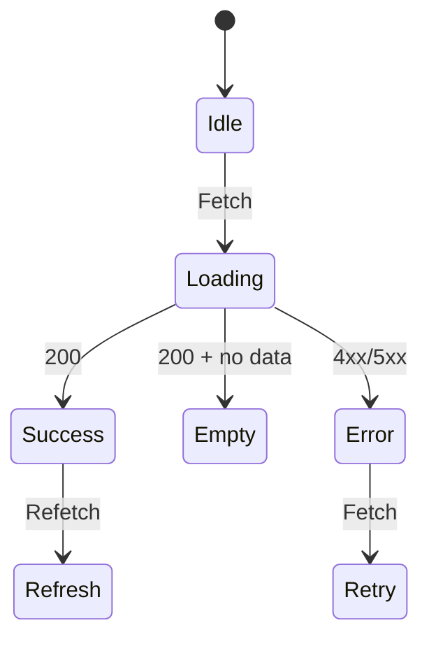

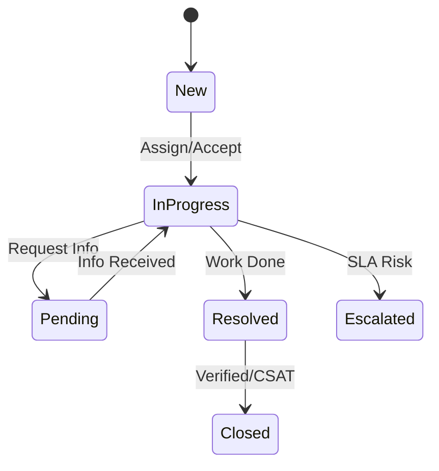

## 7. User Flows and Sequence Diagrams
### 7.1 Customer 360
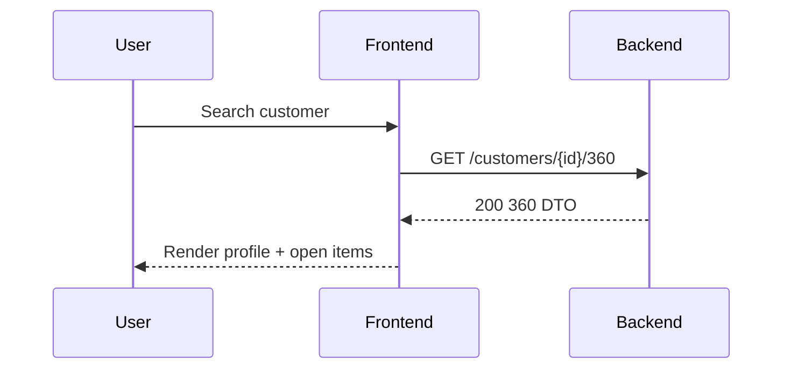

### 7.2 SR Creation and Lifecycle
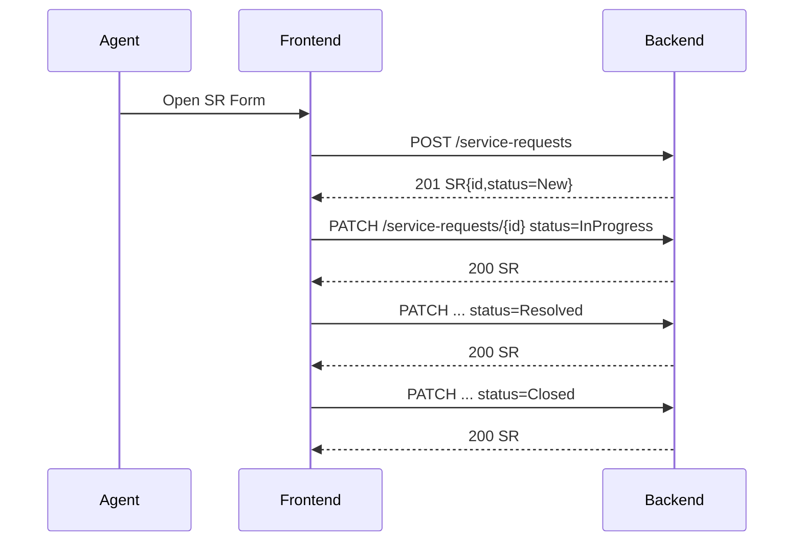

### 7.3 Complaint Escalation
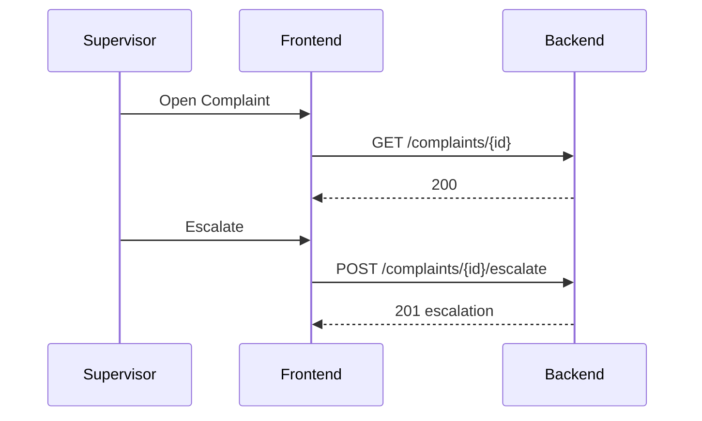

### 7.4 Omni-channel Intake (Inbox)
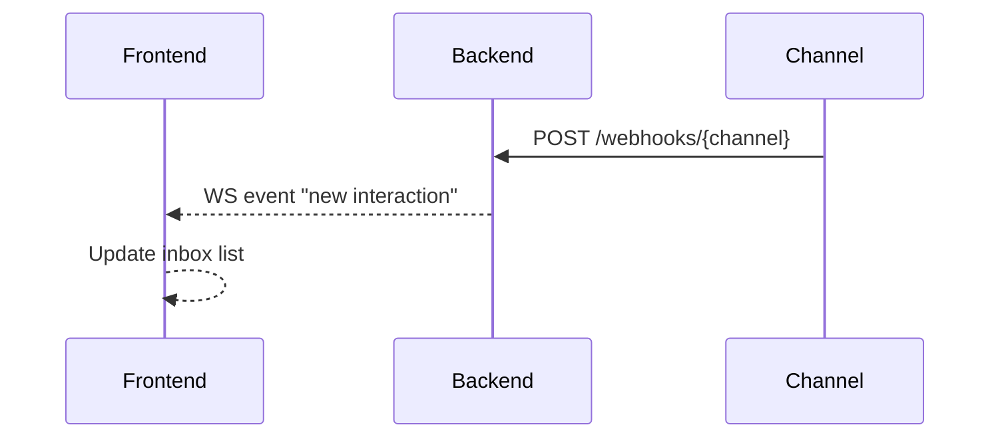

### 7.5 Auth Flows
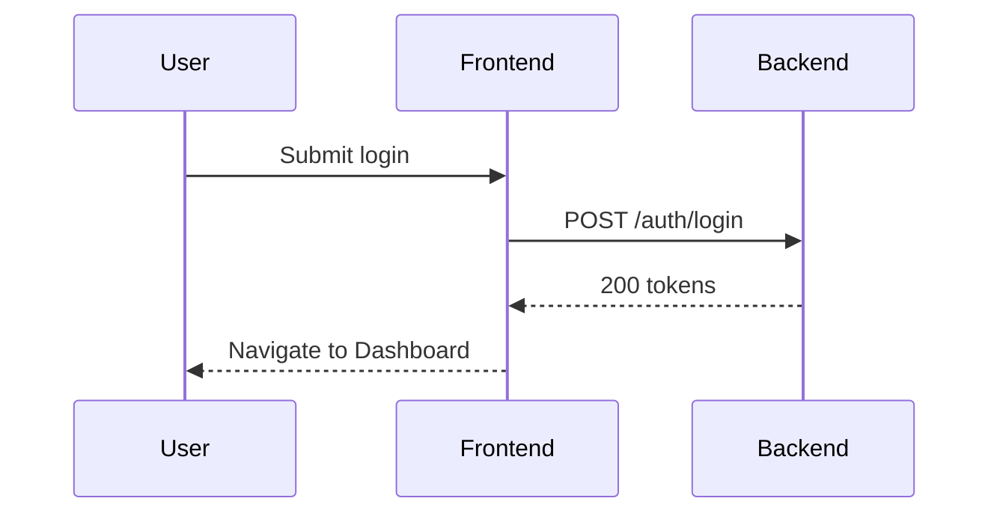

## 8. Style Guidelines (Heritage Brown — Classic)
- Primary: #92400E (rich brown)
- Secondary: #FEF3C7 (warm cream)
- Success: #059669
- Error: #DC2626
- Background: #FFFBEB
- Surface: #FFFFFF
- Text: #111827

Typography:
- Headings: Inter/Segoe UI, weights 600/700; scale 32/24/20/16
- Body: 14–16px normal 400–500
- Caption: 12–13px, muted

Spacing:
- 4px base grid; 4/8/12/16/24/32/48/64

Elevation/Shadows:
- Card: 0 1px 2px rgba(0,0,0,0.05)
- Hover: 0 4px 8px rgba(0,0,0,0.08)
- Modal: 0 16px 32px rgba(0,0,0,0.15)

Iconography:
- Outline icons; 16/20/24 sizes; consistent stroke

Grid/Breakpoints:
- 12-column desktop (min 1200px), 8-col tablet (≥768), 4-col mobile (<768)
- Content max-width 1280px with gutters 24px desktop, 16px tablet, 12px mobile

## 9. Motion and Animation
- Durations: 120–200ms for UI affordances; 250–300ms for modals
- Easing: standard cubic-bezier(0.2, 0.0, 0.2, 1)
- Respect prefers-reduced-motion; disable non-essential animations

Examples:
- Button hover: color/elevation 120ms
- Toast slide-in: 200ms, 16px offset
- Skeleton shimmer: subtle gradient, reduced motion fallback to static

## 10. Responsive and Adaptive Behavior
- Sidebar collapses to icons at 1024px; off-canvas at <768px
- Tables: column priority + horizontal scroll; density switch
- Forms: single-column on mobile, two-column on desktop
- Charts: stack vertically on small screens

## 11. Error, Empty, and Loading States
- Error: inline message with code and retry; toast for global failures
- Empty: contextual illustrations placeholders and CTAs
- Loading: skeletons for lists/cards; spinners for blocking actions

## 12. Internationalization and Localization
- Use ICU message patterns; pluralization support
- Date/time/number formatting via locale
- Avoid embedded HTML in translatable strings
- Layout mirroring readiness for RTL (future)

## 13. Accessibility and Keyboard Navigation Matrix
- Global: Skip to content (Ctrl+Alt+S), Search (/), Open Quick Create (Q), Toggle Sidebar ([)
- Tables: Arrow keys to navigate rows, Enter to open, Space to select, Shift+Arrow to multi-select
- Forms: Tab order by visual flow; Esc closes modal; Enter submits if valid
- Focus management after route changes: send focus to H1

## 14. Design QA Checklist
- Color contrast meets WCAG 2.1 AA
- Focus states visible and non-color cues present
- Keyboard-only usable across screens
- Responsive breakpoints verified
- Semantic HTML landmarks implemented
- Live regions announced for async events
- Forms include labels, descriptions, and error associations
- Loading/empty/error states present for each data view
- Internationalization keys externalized
- Icons have aria-labels or are decorative (aria-hidden)

## 15. Appendix — Annotated Wireframe Placeholders
- To be replaced by image assets in future iterations. Use current mermaid diagrams and markdown sections as interim documentation.
