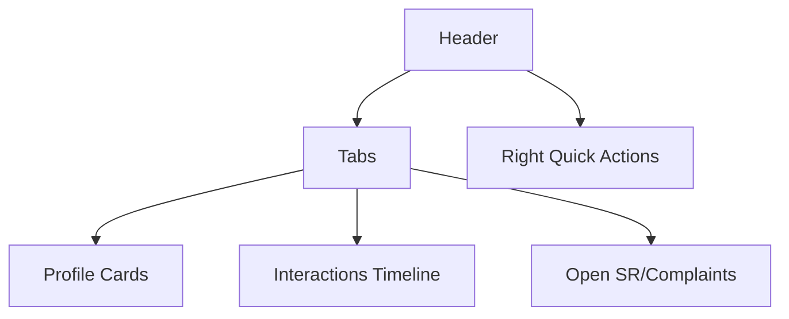

# Screen Spec — Customer 360

## Purpose
Provide a unified view of the customer profile, interactions, related accounts, and open items to speed resolution and improve context.

## Entry and Exit
- Entry: From Search, Links on SR/Complaint, or Sidebar → Customer 360
- Exit: Create SR/Complaint, navigate to related entities

## Layout
- Header: Identity, master no, KYC/risk StatusPills
- Tabs: Profile | Accounts/Policies | Interactions | Open Items | Notes
- Right Panel: Quick Actions and Contact Points

Annotated:

## Components Used (with props)
- StatusPill(status), Avatar, Tabs(items, activeKey), DataTable(columns,data), Timeline(items)
- Buttons: Create SR/Complaint; props {variant='primary'}

## Responsive Rules
- Header stacks on xs; Tabs convert to horizontal scroll; Right Panel collapses below content as accordion

## Validation Rules
- N/A read-only; Actions that create SR/complaint validate customer_id presence

## Errors and Edge Cases
- Partial data: show warnings if upstream sections missing
- No customer found: 404 message with search again action

## Success/Empty States
- Empty interactions: show “No interactions yet” + “Log Interaction” CTA
- Open items empty: show “All clear”

## Interactions and Shortcuts
- 'Q' opens Quick Create menu
- Arrow keys navigate timeline entries

## Analytics Events
- customer360.view {customer_id}
- customer360.quick_create {type}

## Test Scenarios
- Renders tabs and switches content
- Quick Create opens and pre-fills customer context
