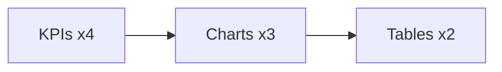

# Screen Spec — Dashboard

## Purpose
Provide at-a-glance operational KPIs, charts, and actionable lists for agents and supervisors.

## Entry and Exit
- Entry: AppShell → Sidebar: Dashboard
- Exit: Navigation to modules via Sidebar or in-page links

## Layout
- Top row: KPI cards (Open SRs, SLA at Risk, Open Complaints, Inbox Today)
- Middle: Charts (SR by Status, Complaints by Severity, Channel Mix)
- Bottom: Tables (My Queue, Recent Interactions)

Annotated diagram:

## Components
- Cards, DataTable, Tabs (optional), Filters (inline)
- Props: DataTable(columns, data, loading, pagination), Card(title, value, delta?)

## Responsive Rules
- KPIs: 4→2→1 across lg→md→xs
- Charts stack vertically below md
- Tables become dense and horizontally scrollable on xs

## Validation Rules
- N/A (read-only). Ensure numeric formatting and percentage correctness

## Errors and Edge Cases
- Loading: skeletons for cards/charts/tables
- Empty: “No items” with filters clear CTA
- Error: Inline message with retry

## Success/Empty States
- Success: KPIs and charts render within 600ms p95 target
- Empty: Show instructions to configure connectors or create SR

## Interactions and Shortcuts
- Clicking KPI navigates to filtered list
- Keyboard: Tab through KPIs → charts → tables; Enter opens first actionable link

## Analytics Events
- dashboard.view
- dashboard.kpi.click {kpi}
- dashboard.table.row.open {entity,id}

## Test Scenarios
- Loads KPIs and charts
- Navigates via KPI click to SR list with filter
- Handles empty dataset gracefully
