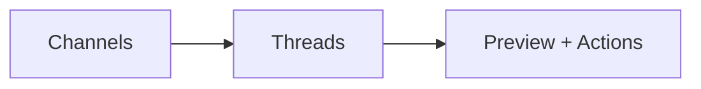

# Screen Spec — Omni-channel Inbox

## Purpose
Provide a unified triage view for voice, email, chat, and social interactions.

## Entry and Exit
- Entry: Sidebar → Omni-channel Inbox
- Exit: Open interaction, Create/Link SR/Complaint

## Layout
- Left: Channels/Folders
- Center: Thread/Message list
- Right: Preview with actions (Reply, Assign, Create SR/Link)

Annotated:

## Components
- TreeNav(items), List(virtualized), PreviewPane, Composer (for email/chat reply)
- Buttons: Reply, Create SR, Link to SR/Complaint

## Responsive Rules
- Right preview becomes full-screen modal on mobile
- Channels collapse to dropdown below md

## Validation Rules
- Reply requires body; restrict dangerous HTML; attachments size limits

## Errors and Edge Cases
- Provider throttle/error: show banner; allow manual retry

## Success/Empty States
- Empty inbox: “All caught up” illustration
- Success toast on send and create/link

## Interactions and Shortcuts
- 'R' reply; 'C' create SR; '/' focus search within inbox

## Analytics Events
- inbox.view {channel}
- inbox.reply.send
- inbox.create_sr

## Test Scenarios
- Navigation across channels
- Reply composer validation
